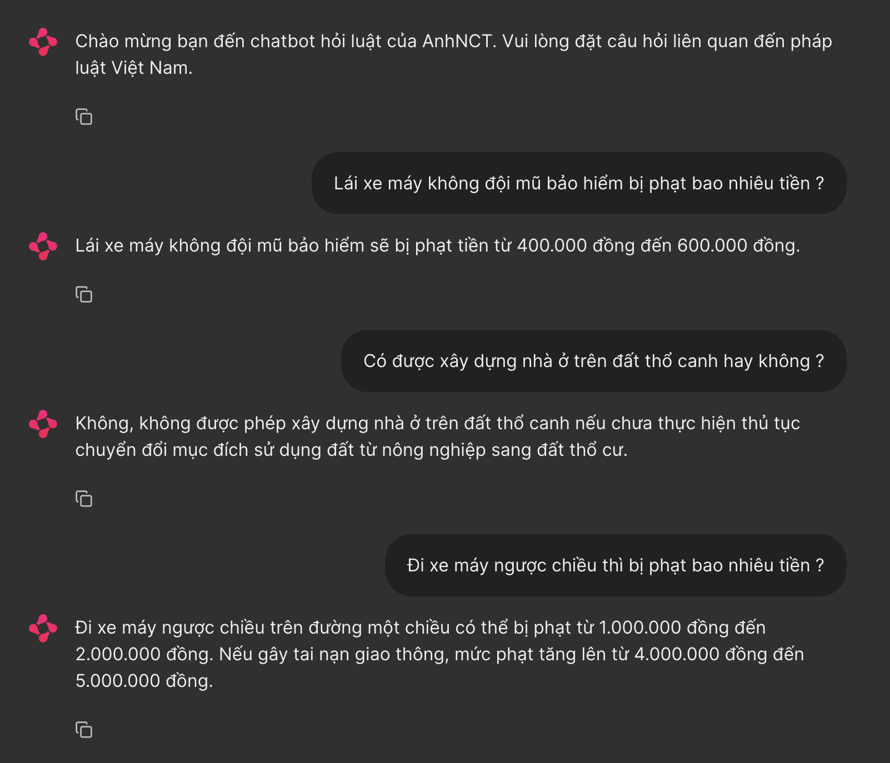

# Project Introduction

This project aims to develop an effective Vietnamese legal question-answering (QA) system using a Retrieval Augmented Generation (RAG) approach. The core objective is to provide accurate and relevant responses to user inquiries regarding legal matters.

# Technical Approach

The system leverages a combination of cutting-edge technologies:

* **Text Embeddings:** OpenAI's `text-embedding-3-small` model is used to generate high-quality embeddings for both user questions and legal documents. These embeddings capture semantic meaning, enabling more precise comparisons between text inputs.
* **Language Model:** The `gpt-4o-mini-2024-07-18` model (from OpenAI) serves as the underlying language model (LLM). This LLM answers question from users
* **Re-ranking with Cohere API:** Due to the current lack of Cross-Encoders specifically designed for Vietnamese, the Cohere API is employed for re-ranking search results. This step enhances the accuracy of the final answer selection.
* **Dynamic Data Crawling:**  If a user's question cannot be answered by the existing stored data, the system automatically crawls relevant legal sources to find the appropriate information. This newly acquired data is then stored along with the answer provided to the user, enriching the knowledge base for future queries.

# Pipeline Overview

1. The user's query is input into the system, and it's embedded to search for similar chunks of information within the database.
2. Ranked results from the similarity search step are re-ranked through cohere API
3. The re-ranked results are passed to the LLM, which assesses whether there's enough information to answer the query.
4. If there's enough data, the LLM generates the final output and presents it to the user.
5. If there isn't enough information, new data is crawled from external sources.
6. The crawled data is chunked and embedded before being added to the database.
7. The similarity search is repeated with the updated database.
8. The search results are re-ranked
9. Redundant information from crawling is removed from the database and only save top-k chunks most relevant to the query.
10. Re-ranked results are passed to LLM and the final output is generated and presented to the user.


# Running
1. Install required libraries: ```pip install -r requirements.txt```
2. Create .env file and set up API keys:
   ```
      OPENAI_API_KEY=your_openai_api_key
      COHERE_API_KEY=your_cohere_api_key
      SERPAPI_KEY=your_serpapi_key
     ```
3. Run Chainlit: ```chainlit run app.py --host 0.0.0.0 --port 1688 &> content/logs.txt```

# Demo




